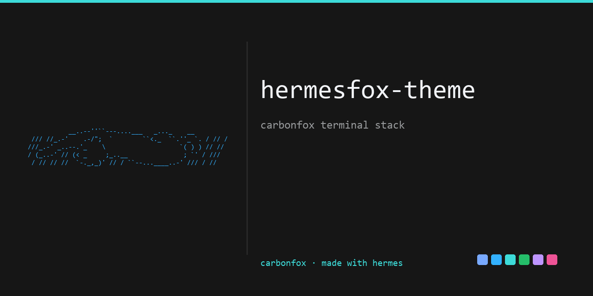

```text
           __..--''``---....___   _..._    __
 /// //_.-'    .-/";  `        ``<._  ``.''_ `. / // /
///_.-' _..--.'_    \                    `( ) ) // //
/ (_..-' // (< _     ;_..__               ; `' / ///
 / // // //  `-._,_)' // / ``--...____..-' /// / //
```

# hermesfox-theme

[](LICENSE)
[](#)
[](#)
[](#)


<!-- og:image for GitHub social preview -->


A cross-application **Carbonfox** theme for the whole terminal stack — Hermes
Agent, WezTerm, Windows Terminal, zellij, nvim, and VS Code — plus the banner
ASCII-art archive and the font setup.

The palette originates from [EdenEast/nightfox.nvim]
(`lua/nightfox/palette/carbonfox.lua`). This repo is the canonical, portable
home for that palette applied end to end.

> **2026-08-22:** this repo replaces the previous Carbonfox gist
> (`16349ada05bdf04399aa328fd0231184`), which was folded in and retired.

## Palette

| Role | Hex |
|---|---|
| Background | `#161616` |
| Background alt | `#0d0d0d` |
| Surface | `#282828` |
| Surface selected | `#525253` |
| Foreground | `#f2f4f8` |
| Foreground alt | `#dfdfe0` |
| Muted / comment | `#97999b` |
| Blue | `#78a9ff` |
| Cyan | `#33b1ff` |
| Teal / cyan-bright | `#3ddbd9` |
| Green | `#25be6a` |
| Purple | `#be95ff` |
| Red / pink-red | `#ee5396` |
| Warm orange (warning) | `#ff9e64` |
| Yellow / teal | `#08bdba` |

Machine-readable tokens: [`palette.json`](palette.json).

## Layout

| Path | What it is |
|---|---|
| `hermes/skins/carbonfox.yaml` | **Canonical Hermes skin** — colors, `banner_hero` (cat-in-box), `banner_logo` (swan + block text). Live copy: `$HERMES_HOME/skins/carbonfox.yaml`. |
| `hermes/skins/carbonfox-hermes.yaml` | Portable duplicate of the skin (the old gist's copy). |
| `wezterm/wezterm.lua` | WezTerm main config — font, `color_scheme = 'carbonfox'`, 170×45, spawns zellij. |
| `wezterm/wezterm-{hermes,notes,gitdiffs}.lua` | WezTerm layout variants (per Start-Menu shortcut). |
| `windows-terminal/settings.json` | Full Windows Terminal config (font + profiles + Carbon Fox scheme). |
| `windows-terminal/scheme.json` | Portable Carbon Fox scheme object (for pasting into any terminal). |
| `zellij/config.kdl` | zellij config with the embedded `carbonfox` theme block + `theme "carbonfox"`. |
| `zellij/layouts/*.kdl` | zellij layouts (dev / hermes / notes / gitdiffs). |
| `nvim/init.lua` | nvim config — `nightfox.nvim` → `colorscheme("carbonfox")`. |
| `vscode/settings.json` | VS Code settings (font family `Hack Nerd Font Mono`). |
| `vscode/carbonfox.vscode-theme.json` | Standalone VS Code color theme file. |
| `vscode/vscode-color-customizations.json` | VS Code `workbench.colorCustomizations` snippet. |
| `ascii-art/` | Banner ASCII art archive (swan, love-birds, goose, cat-in-box, …) + budget notes. |
| `fonts/install-hack-nerd-font.sh` | Per-user install of Hack Nerd Font Mono from the Nerd Fonts release. |

## Font

The stack uses **Hack Nerd Font Mono** (size 10). The font is not vendored
here — it's ~32MB of TTFs. Install it with:

```bash
bash fonts/install-hack-nerd-font.sh
```

This downloads `Hack.zip` from the official Nerd Fonts GitHub release, installs
the TTFs per-user (no admin), and registers the font in the registry.

## Install / point configs at this repo

The configs here are working copies. To restore them on a fresh machine, copy
each file to its live location (paths in the zellij layouts and nvim use a
`<USER>` placeholder — replace it with your Windows username):

| Repo file | Live location |
|---|---|
| `hermes/skins/carbonfox.yaml` | `%LOCALAPPDATA%/hermes/skins/carbonfox.yaml` |
| `wezterm/*.lua` | `~/.config/wezterm/` |
| `windows-terminal/settings.json` | `%LOCALAPPDATA%/Packages/Microsoft.WindowsTerminal_8wekyb3d8bbwe/LocalState/settings.json` |
| `zellij/config.kdl`, `zellij/layouts/*.kdl` | `%APPDATA%/Zellij/config/` |
| `nvim/init.lua` | `%LOCALAPPDATA%/nvim/init.lua` |
| `vscode/settings.json` | `%APPDATA%/Code/User/settings.json` |

> **Portable paths:** WezTerm and VS Code configs derive paths from env vars
> (`os.getenv('LOCALAPPDATA')`, `${userHome}`), so they work on any machine.
> The zellij layouts and nvim carry a `<USER>` placeholder in launcher paths —
> swap it for your username. The plugin paths in `zellij/config.kdl` point at
> the user data dir; re-point them to your `%APPDATA%/Zellij/data/plugins/`.

## License

MIT. Palette adapted from EdenEast/nightfox.nvim (MIT). ASCII art is sourced
from the public ASCII-art archives (asciiart.eu, jgs classics) and the
in-house cat-in-box/braille heroes; see `ascii-art/README.md` for provenance.
